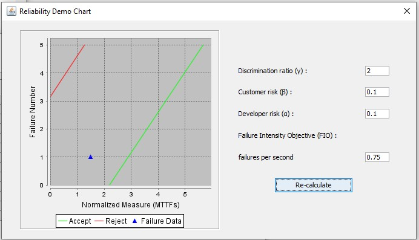
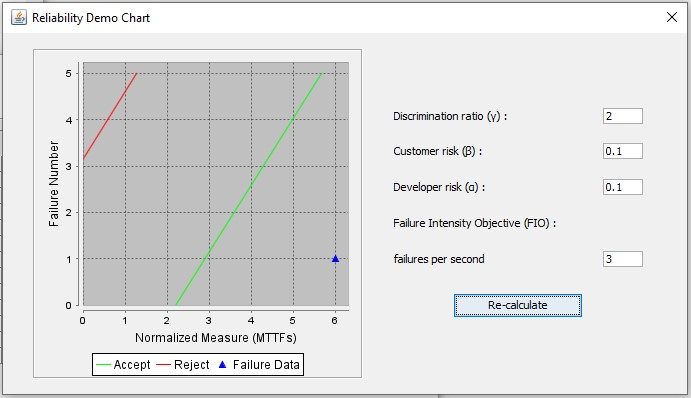

**SENG 637- Dependability and Reliability of Software Systems\***

**Lab. Report \#5 – Software Reliability Assessment**

| Group \#:      |     |
| -------------- | --- |
| Student Names: |     |
| Gopal Sharma   |     |
| Jubayer Ahmed  |     |
| Usman Liaqat   |     |
| Raveen Parmar  |     |
| Ehsan Liaqat   |     |

# 1. Introduction

The lab’s aim was to enhance our grasp of assessing tool reliability and using tools like C-SFRAT and the Reliability Demonstration Chart through Excel. It also covered failure reliability growth testing, which tracks how a product improves over time. We learned about failure data too, which is key in learning from past issues to prevent future ones. These concepts have deepened our understanding of the role of reliability testing in software testing processes.

# 2. Assessment Using Reliability Growth Testing

## a) Result of Model Comparison (Selecting Top Two Models)

To evaluate the reliability of our software, we used the C-SFRAT tool to compare different models. We aimed to find the two best-fitting models based on their ability to predict software failures.

## b) Model Selection Process

We considered several models and looked at various statistics to judge how well they fit our data. The two main statistics we used were the Akaike Information Criterion (AIC) and the Bayesian Information Criterion (BIC). A lower AIC or BIC value generally means a better model fit, considering the number of parameters in the model.

## c) Results

After running the analysis, we found that the two models that best fit our data were:

1. The model labeled as DW3 with covariate 'F', which had the lowest AIC and BIC values among the models considered.
2. The IFRGSB model, also with covariate 'F', showed a good fit according to its log-likelihood value, which is a measure of how likely it is to observe our data given the model.

These models are represented in the screenshots provided.

The first screenshot shows the graph of all models' fits to the data. As seen in the provided graph , the selected models closely follow the trend of the imported failure data, indicating a strong fit

The second screenshot lists the models and their corresponding AIC and BIC values.In terms of numerical comparison, the detailed statistics of AIC and BIC scores for these models can be seen in the accompanying table , where the superiority of DW3 and IFRGSB models is evident due to their lower scores compared to other models

## d) Conclusion

The DW3 and IFRGSB models stood out in our analysis. These models are the most suitable for our data, as they provide a balance between accurately fitting our past failure data and avoiding overly complex models that are difficult to generalize. They will be used to inform our understanding of the software's reliability and guide future testing efforts.

## e) Result of range analysis (an explanation of which part of data is good for proceeding with the analysis)

          ******Pending*******

## f) Plots for failure rate and reliability of the SUT for the test data provided

### MVF Graph for Model 1:

### Intensity Graph for Model 1:

### MVF Graph for Model 2:

### Intensity Graph for Model 2:

### Reliability Graph Prediction (SRTAT):
    ******Pending*******

### Reliability Graph Prediction (C-SFRAT):
    ******Pending*******

## g) A discussion on decision making given a target failure rate
In this stage of our assessment, we focused on establishing a target failure rate, which serves as a critical benchmark for the reliability of the software. This target is derived by analyzing the frequency of observed failures over the operational hours of the system. A crucial aspect of this analysis was to determine a failure rate that ensures user safety while maintaining the functional integrity of the software.

By employing the predictive capabilities of C-SFRAT and cross-validating with SRTAT, we were able to set a failure rate target. This rate was calculated by dividing the total number of observed failures by the cumulative operational hours. The goal was to identify a rate that would not only be realistic but also indicative of a high-reliability standard.

Our targeted failure rate is oriented toward minimizing system downtime and ensuring a seamless user experience. With the reliability models' lowest failure intensities in mind, we set an ambitious yet achievable target. This target underpins our commitment to rigorous testing and continuous improvement, ensuring that the software meets the robust reliability criteria we have set forth before it is released to our end-users.
    

## h) A discussion on the advantages and disadvantages of reliability growth analysis
    ******Pending*******

# 3. Assessment Using Reliability Demonstration Chart

The figure above shows that with a risk tolerance set at 1 failure every 10 seconds and a discrimination ratio of 2, the system will be deemed acceptable if it achieves a Failure Intensity Object of 1.5 failures per second. Therefore, both developers and customers require the software to not exceed one failure every 10 seconds.

The discrimination ratio is used to indicate the level of error tolerated in the calculations and corresponds to the gap between the acceptance and rejection thresholds. For the software to be considered satisfactory by developers and customers, it must reach a minimum Failure Intensity Object of 1.5 failures per second.

The figure above demonstrates what happens to the Failure Intensity Object (FIO) when it is halved. The reset of failure data in the continuation of the graph indicates that the FIO data neither meets nor fails the risk requirements. Instead, it remains undetermined due to the allowable error introduced by the discrimination ratio. For example, if the discrimination ratio were reduced, the failure data would be rejected under those conditions.

The figure above illustrates the effect of doubling the Failure Intensity Object (FIO), raising it to 3. This increase results in failure data significantly exceeding the acceptance rate. With an FIO of 3, the system clearly surpasses both customer and developer expectations.

# Comparison of Results
    ******Pending*******

# Discussion on Similarity and Differences of the Two Techniques

Exploring the various techniques and noting their differences was enlightening. Both methods differ yet provide visual analyses of failure rates in relation to expected values. Reliability Growth Testing offered a comprehensive view of the entire dataset over the specified timeframe, whereas the Reliability Demonstration Chart specifically facilitated comparisons between clearly accepted and rejected conditions.

The Reliability Demonstration Chart primarily highlights the system’s reliability, while Reliability Growth Testing not only enhances system reliability but also identifies overall system deficiencies. Employing these diverse techniques further enables a more complete understanding of the issues at hand and promotes improvements across various aspects simultaneously.

# How the team work/effort was divided and managed

We divided into two pairs, with each duo focusing primarily on either part one or part two of the project. Despite the division, we consistently communicated with the other pair to ensure a comprehensive understanding of the entire lab and to provide assistance whenever necessary. We arranged regular meetings every few days to review our progress and determine if further support was required. Although each team was assigned different sections, we made efforts to collaborate whenever possible.

# Difficulties encountered, challenges overcome, and lessons learned

SRTAT and the Excel sheet did not function as outlined in the lab handout, necessitating the use of C-SFRAT for the first part of the lab. Additionally, the lab instructions were not clear. Initially, the RDC spreadsheet was challenging to operate and understand, especially as it required editing privileges for modifications. However, after reviewing the instructions, using the RDC program became much simpler.

# Comments/feedback on the lab itself
The lab presented significant challenges due to the lack of detailed instructions and helpful tips, making it difficult to navigate and use the provided tools effectively. For instance, in the RDC section, the abundance of data and its disorganized presentation made it confusing to determine which values needed adjustment and which data required attention. Clearer guidance and more specific details on key areas to focus on would have greatly enhanced our ability to proceed with the lab tasks.
