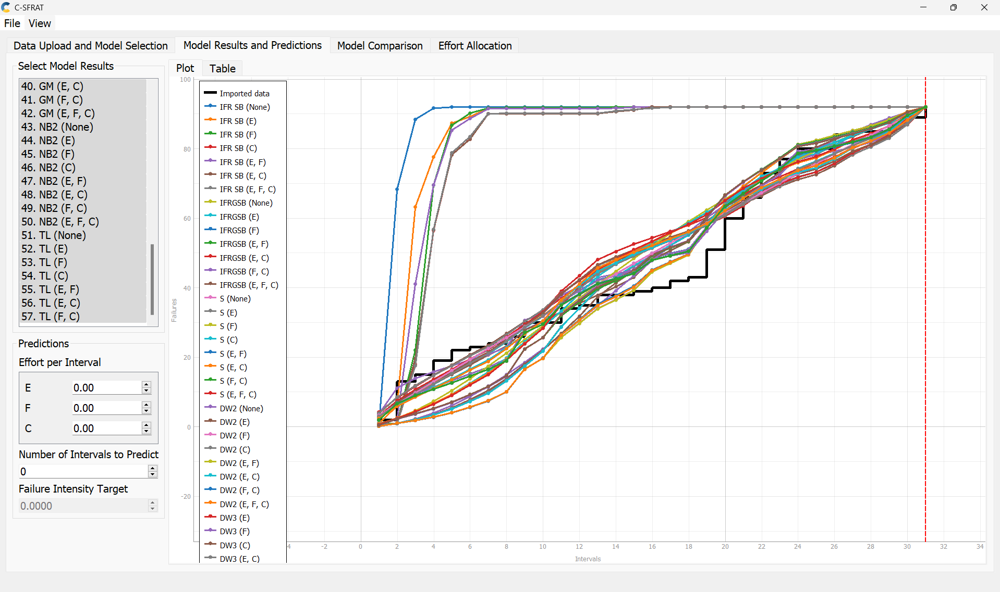
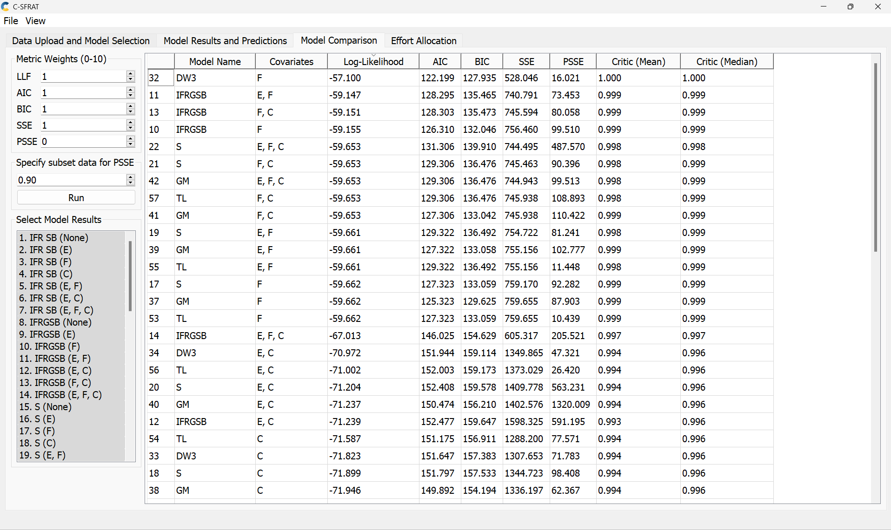
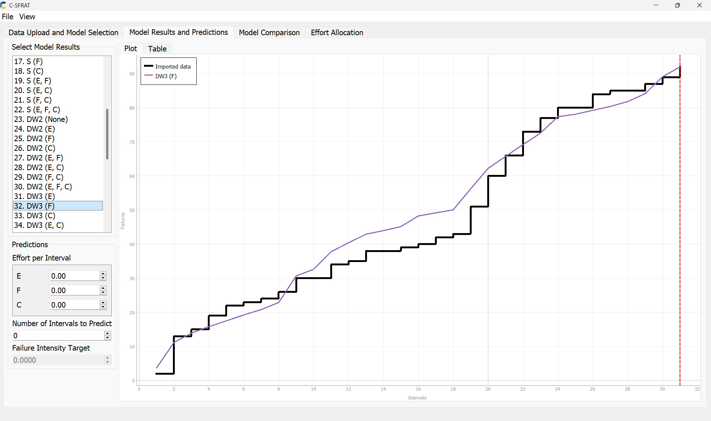
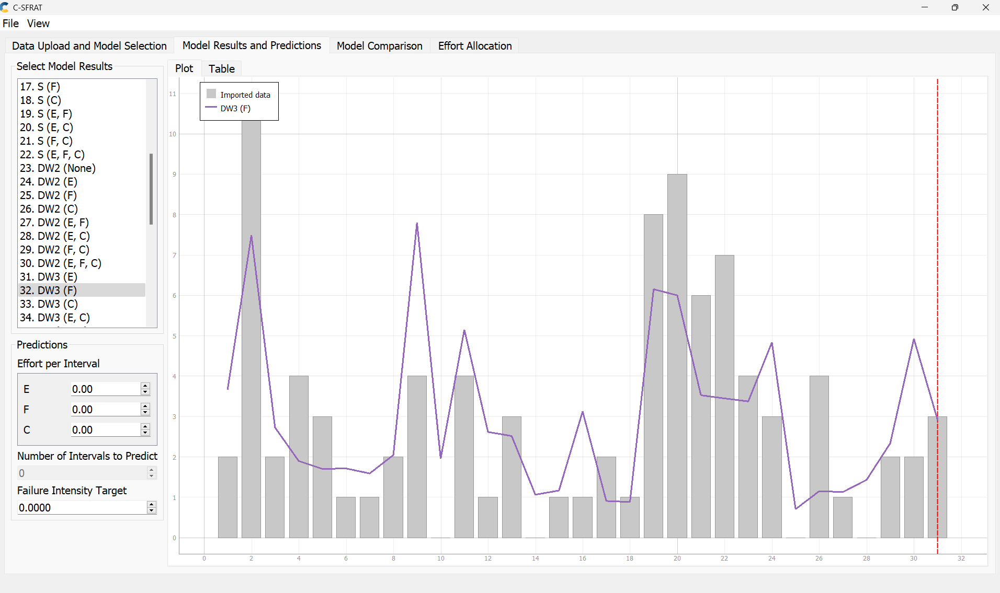
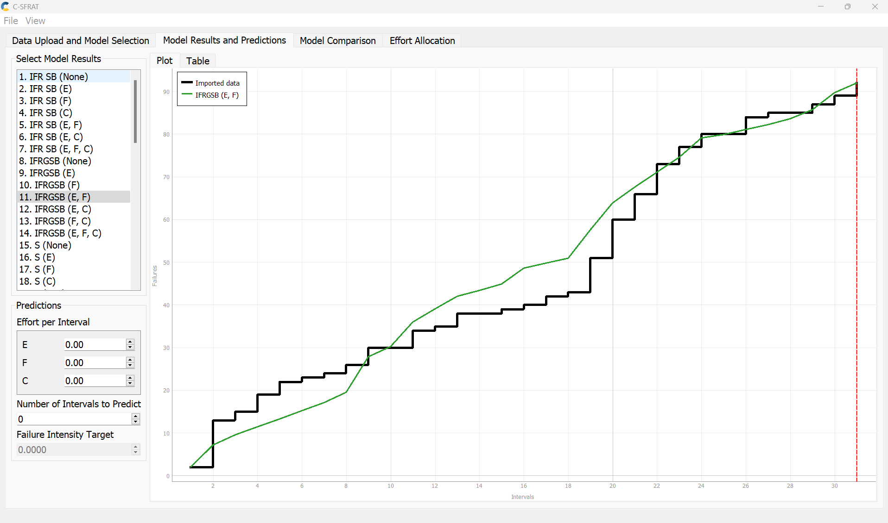
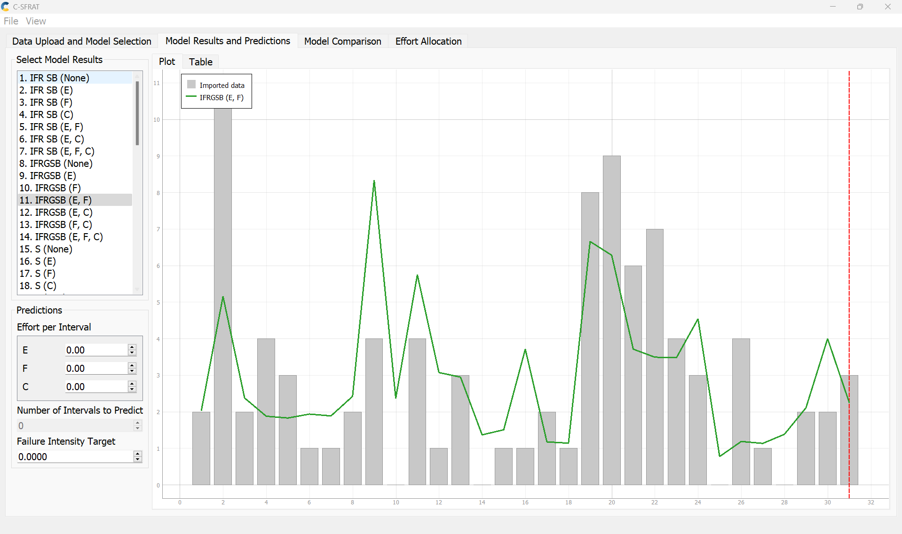

**SENG 637- Dependability and Reliability of Software Systems\***

**Lab. Report \#5 – Software Reliability Assessment**

| Group \#:      |     |
| -------------- | --- |
| Student Names: |     |
| Gopal Sharma   |     |
| Jubayer Ahmed  |     |
| Usman Liaqat   |     |
| Raveen Parmar  |     |
| Ehsan Liaqat   |     |

# 1. Introduction

The lab’s aim was to enhance our grasp of assessing tool reliability and using tools like C-SFRAT and the Reliability Demonstration Chart through Excel. It also covered failure reliability growth testing, which tracks how a product improves over time. We learned about failure data too, which is key in learning from past issues to prevent future ones. These concepts have deepened our understanding of the role of reliability testing in software testing processes.

# 2. Assessment Using Reliability Growth Testing

## a) Result of Model Comparison (Selecting Top Two Models)

To evaluate the reliability of our software, we used the C-SFRAT tool to compare different models. We aimed to find the two best-fitting models based on their ability to predict software failures.

## b) Model Selection Process

We considered several models and looked at various statistics to judge how well they fit our data. The two main statistics we used were the Akaike Information Criterion (AIC) and the Bayesian Information Criterion (BIC). A lower AIC or BIC value generally means a better model fit, considering the number of parameters in the model.

## c) Results

After running the analysis, we found that the two models that best fit our data were:

1. The model labeled as DW3 with covariate 'F', which had the lowest AIC and BIC values among the models considered.
2. The IFRGSB model, also with covariate 'F', showed a good fit according to its log-likelihood value, which is a measure of how likely it is to observe our data given the model.

These models are represented in the screenshots provided.

The first screenshot shows the graph of all models' fits to the data. As seen in the provided graph , the selected models closely follow the trend of the imported failure data, indicating a strong fit

The second screenshot lists the models and their corresponding AIC and BIC values.In terms of numerical comparison, the detailed statistics of AIC and BIC scores for these models can be seen in the accompanying table , where the superiority of DW3 and IFRGSB models is evident due to their lower scores compared to other models

## d) Conclusion

The DW3 and IFRGSB models stood out in our analysis. These models are the most suitable for our data, as they provide a balance between accurately fitting our past failure data and avoiding overly complex models that are difficult to generalize. They will be used to inform our understanding of the software's reliability and guide future testing efforts.

## e) Result of range analysis (an explanation of which part of data is good for proceeding with the analysis)

## f) Plots for failure rate and reliability of the SUT for the test data provided

### MVF Graph for Model 1:

### Intensity Graph for Model 1:

### MVF Graph for Model 2:

### Intensity Graph for Model 2:

### Reliability Graph Prediction (SRTAT):

### Reliability Graph Prediction (C-SFRAT):

## g) A discussion on decision making given a target failure rate

## h) A discussion on the advantages and disadvantages of reliability growth analysis

# 3. Assessment Using Reliability Demonstration Chart

#

# Comparison of Results

# Discussion on Similarity and Differences of the Two Techniques

# How the team work/effort was divided and managed

#

# Difficulties encountered, challenges overcome, and lessons learned

# Comments/feedback on the lab itself
