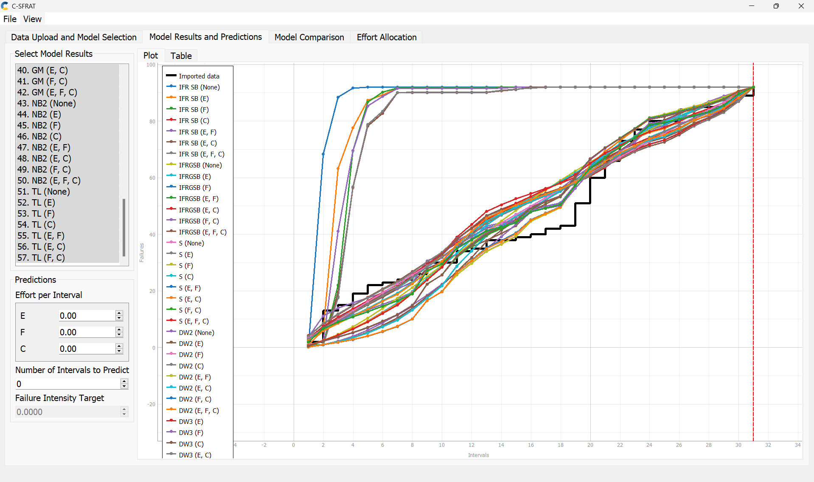
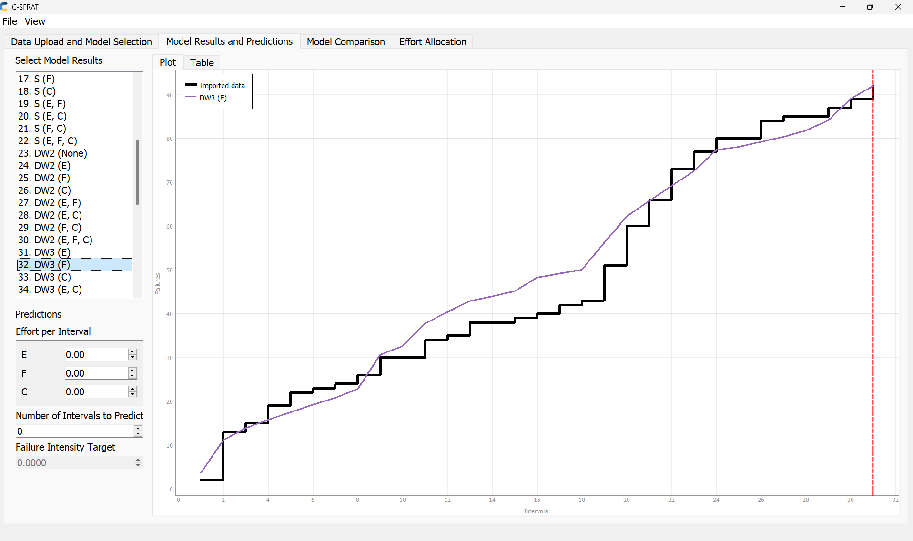

**SENG 438- Software Testing, Reliability, and Quality**

**Lab. Report \#5 – Software Reliability Assessment**

| Group \#21:    |                 |
| -------------- | --------------- |
| Student Names: | Lauraine Baffot |
|                | Alexis Hamrak   |
|                | Abhay Kholsa    |
|                | Rachel Renegado |

# Introduction

The main purpose of this lab was to help us discover the reliability assessment and the usage of the tools such as C-SFRAT and the Reliability Demonstration Chart with the help of Excel. This lab assignment also explored the failure reliability growth testing which helps analyze the product’s changes over a period of time. Additionally, this lab also introduced to us the concept of failure data which is critical to analyze as it can aid us in determining how to prevent future failures. Overall, these new concepts solidified the theoretical lectures helped us understand where reliability testing plays its role in software testing procedures.

# Assessment Using Reliability Growth Testing

## Result of model comparison (selecting top two models)

In this section of the lab assignment, we had to select the best two models using the failure data provided to us the benefit of using the C-SFRAT was that we could simply import the CSV file into this GUI and we could use the functions to determine which fits in well with our data, this feature of Model Results and Predictions it will enable us to narrow which function resembles the closest to the failure data. To approach finding the best two models we select all the possible comparisons we could perform with the covariates. Here we can see all of the models which were selected to see which one would fit the best into our failure data.

To compare these models we selected the Model Comparison tab to present us with a table of all the models, in which we could select the top two models easily.

With the help of this table, we can see the log-likelihood which we assumed means which model would fit closely with our failure data from this we were able to make out the DW3 (F) and IFRGSB(E, F) were the closet models to our failure data. In which DW3 means Discrete Weibull (Type III) and IFRGSB full form being IFR generalized Salvia & Bollinger. These functions were not covered in the lectures so we cannot go into greater detail in their mathematical formulas for the functions.

## Result of range analysis (an explanation of which part of the data is good for proceeding with the analysis)

For the range analysis, we had to look at the data which would fit the points on the failure data graph the best this was our strategy to achieve the best models from the ones the C-SFRAT provided to us. As mentioned above, we also made sure to look at the log-likelihood column and find the biggest two numbers (-57.100 and -59.147) and that is how we were able to identify our two top models displayed below. The range was also primarily used as the number of failures in the dataset as well in which we could create the 31 intervals to provide us analyzing our reliability of the failures which occurred during that time.

## Plots for failure rate and reliability of the SUT for the test data provided

MVF Graph for Model 1:

Intensity Graph for Model 1:

MVF Graph for Model 2:

Intensity Graph for Model 2:

Reliability Graph Prediction (SRTAT):

Reliability Graph Prediction (C-SFRAT):

## A discussion on decision making given a target failure rate

For deciding on the failure rate target we used the C-SFRAT tool again to help us predict the testing of the new prediction intervals, we also used the other tool SRTAT to help with predicting the failure rate based on the failure number of the data. From both of these tools, we were able to make a target the failure rate being which is dividing the failure numbers by the total number of hours the system is running. Failure rate also helps us in determining how much we need to improve our testing in order to bring this rate down in order to gain assurance on the number of failures the system would experience when released to the end-users. Our aim was to have the lowest possible rate we could to ensure the reliability of the failure data given to us is not at a dangerous level in terms of the safety of the application. With our two predictions, we wanted to set a target of the failure rate to be 0.4 as this was the lowest intensity for both of the models in the desired intervals for the intensity graph displayed in the above section. With this target failure rate, the failure data shall provide reliability to the system under the testing where this data originated from.

## A discussion on the advantages and disadvantages of reliability growth analysis

### Advantages

- The graphs produced by a reliability growth analysis show any time-dependent trends, allowing us to make decisions based on past behavior and predict how our data will behave in the future.
- It is easy to determine and examine the changes at a specific point in time from the results of a reliability growth analysis therefore determine and examine the impact that those changes in the development of the project.

### Disadvantages

- It is very tedious to create these graphs to analyze the reliability of a system under the test.
- Using different tools with the same data brings on different results for the graphs.
- The prediction models can differ based on the mathematical functions used in determining a target failure for the system.
- Failure data entry into the Excel files can take a long time to input into the tools for example using the C-SFRAT we had to input the failure data into the Excel file that was already done for us beforehand.

# Assessment Using Reliability Demonstration Chart

## 3 plots for MTTFmin, twice and half of it for your test data

### MTTFmin

The above image displays the plot for MTTFmin. Through trial and error, we developed the plot above using the provided failure data as input to visualize the reliability of the system. As plotted, the reliability trend displayed suggests that the trend is acceptable for our FIO (does not dive heavily into the reject range). The calculation for MTTF, in this case, is 100/200,000, which gives an MTTF of 0.0005.

### Half MTTFmin

The above image displays the plot for half MTTF. After the MTTFmin plot was found, the parameters were adjusted accordingly for half of the previous MTTF. The calculation for MTTF, in this case, is 25/100,000, which gives an MTTF of 0.00025. This trend dives more within the reject range which corresponds to the changes we made for this graph. Since we **decreased** the number of acceptable failures, our failures in the half MTTF plot should have more data points in the **reject** region.

### Twice MTTFmin

The above image displays the plot for twice MTTF. After the MTTFmin plot was found, the parameters were adjusted accordingly for twice the initial MTTF. The calculation for MTTF, in this case, is 400/400,000, which gives an MTTF of 0.001. This trend dives more within the acceptable range which corresponds to the changes we made for this graph. Since we **increased** the number of acceptable failures, our failures in the twice MTTF plot should have more data points in the **accept** region.

## Explain your evaluation and justification of how you decide on the MTTFmin

The MTTFmin was found using trial and error with the RDC chart. We began by adjusting the data (ensuring that the graph axes were correct) and then adjusted the data for calculating MTTF until we found an ideal value. When choosing the value for MTTF, we tried whole values divisible by 10. For example, we tested 200 failures, 500, 100, 50, etc. as well as 100,000 input events, 200,000, 50,000, 100,000, etc. When testing all of these values, our graph regions were constantly shifting and it required a large amount of time to adjust them for each trial. Instead of continuous testing with more specific values, we settled on one that was good enough with the given data - allowing it to follow a trend similar to the slides we had been shown in the lecture. This value was found to be 100 acceptable failures per 200,000 input events (time units of seconds) - giving us a MTTFmin of 100/200,000 = 0.0005. Our MTTFmin value was chosen as 0.0005 specifically because it allowed for most of the data points to fall under the “continue testing” area, eventually leading to the SUT becoming acceptable.

## A discussion on the advantages and disadvantages of RDC

### Advantages

- RDC is a fairly simple way to assess a system’s reliability. It is very straightforward to assemble a spreadsheet or find a tool to plot test data with and determine how the SUT performs over time. In addition, it does not require much time to generate the plots and analyze them.
- RDC is a very low-cost method of determining system reliability because the software required to generate the plots is nothing fancy, just a simple excel sheet will work.

### Disadvantages

- RDC is unable to output a quantitative number for the reliability of a system. A reliability number would be important and very useful in support of decisions and making conclusions on the overall reliability of the system. Unfortunately, RDC is unable to develop this quantitative value but can only visualize the trend for reliability.
- The MTTF needs to be calculated and unfortunately, it requires a lot of “guess and check” to see which value works the best. This requires rather tedious amounts of work if you do not have an idea of what value to use.

# Comparison of the RDC Results with Part 1

### Comparison

The results in part 1 were about the earlier prediction of the reliability of the system in which we were presented with the covariates to determine an acceptable failure rate target of 0.4 for the 99 intervals - resulting in 0.004. Similarly in Part 2 using RDC, we found the Mean Time to Failure (MTTFmin) to be 100 acceptable failures over 200,000 events - resulting in 0.0005. Comparing the two target failure rates, they are quantitatively close.

### When to use each technique

Reliability Growth Testing (RGT) is done to analyze current reliability. In addition, it can be used to identify and eliminate faults, and forecast future reliability. The reliability figures are compared with intermediate reliability objectives to measure progress so that resources can be directed to achieve the reliability goals in a timely and cost-effective manner. Whenever a failure occurs, an action is executed to remove the problem.

Reliability Demonstration Chart (RDC) is done toward the **end** of the growth testing period to verify that a specific reliability level (FIO) has been achieved. During this stage, the software code is frozen.

# Discussion on Similarity and Differences of the Two Techniques

### Similarities

- The same dataset of failures was used as input for both techniques.
- Both techniques were testing the same system.
- Both techniques are based on failure times and target failure rate (MTTF).

### Differences

- Both techniques interpreted the data differently to develop different plots on the reliability of the system.
- The first technique, reliability growth analysis, uses failure count as well as inter-failure times while RDC only uses inter-failure times.

# Lessons Learned

There are many different tools available that can be used to determine the reliability of a system. These tools can all give fairly accurate results, however, they are only a simulation of how the system should behave. In reality, the SUT needs to be thoroughly tested. In addition, the tools cannot be relied on as they are not necessarily correct. This is because most of the data is calculated and approximated within each tool. Another lesson we learned is that the learning curve for these tools was pretty high and required background knowledge of each functionality and interpreting the results. This was a great lesson to learn, as we will likely encounter these tools when we start working in the industry, and being familiar with how they work now will benefit us later.

# How the teamwork/effort was divided and managed

The team decided to work all together for this lab. We first installed the tools that were required to complete the lab and worked together to understand how the tools worked. We decided to use C-SFRAT because it seemed to work the best with our laptops. Unfortunately, Alexis and Rachel were unable to use the tool on their computers, so in order to split the work evenly, Abhay and Lauraine worked on Part 1 using C-SFRAT and SRTAT, and Alexis and Rachel worked on Part 2 with the RDC excel chart. After all of the necessary components such as failure ranges were compiled and the graphs were finished, all of the members worked together to write the report and discuss how their tools worked and what their results were.

# Difficulties encountered, challenges overcome, and lessons learned

There were obstacles that resulted from the incompatibilities with Mac OS and the software that were required to complete the lab. Due to this incompatibility, it was difficult to work efficiently when only half the group was able to operate the appropriate software (C-SFRAT) to visualize and analyze the data. We overcame this challenge by implementing a peer programming style approach to this lab by having the two working computers use C-SFRAT and the other two analyze the data visuals generated.

# Comments/feedback on the lab itself

In the future, it would be more efficient and beneficial to all students if the software used in the lab was compatible with all OS to eliminate the obstacles we had to face. In addition, further instructions would have been helpful to allow us to properly understand how the tools worked and explain what their results meant. When being asked to use a new tool, it is extremely difficult and time-consuming to learn how to use that tool without proper instructions. In addition, it felt like a waste of time when figuring out how to use the tools since we had to complete a lot of trial and error with the input data. Having many other classes to work on did not allow us to have much time to work in the lab and we had to choose the best values when we found them instead of looking for better results.
